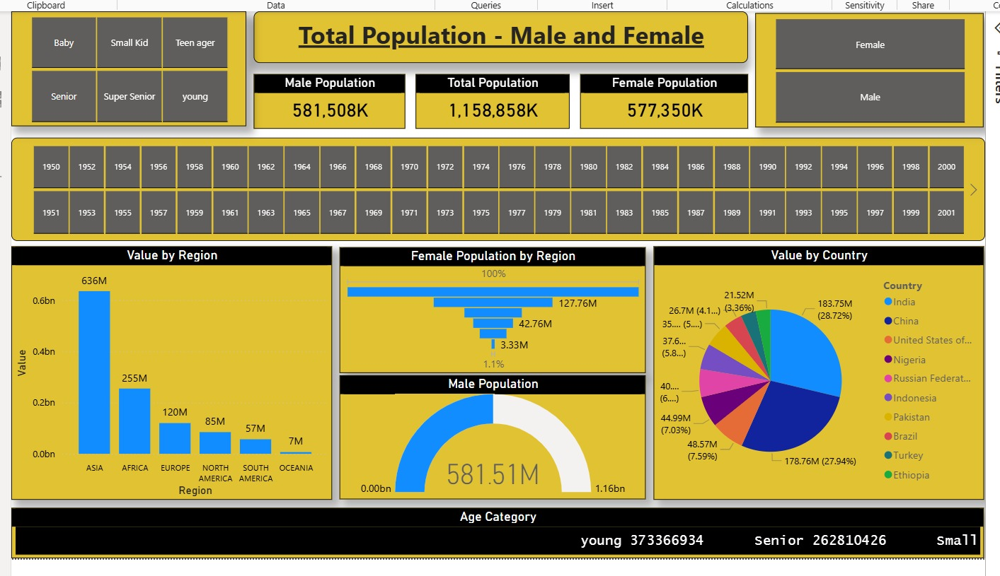
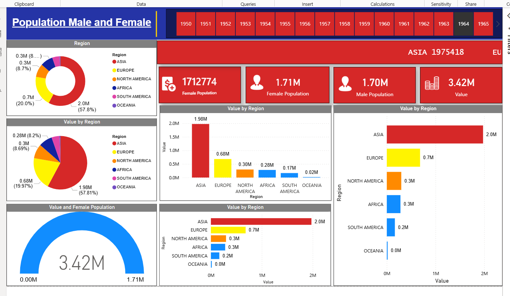

# 📊 Population Analysis Dashboard – Power BI

A complete analytical Power BI project visualizing **Male & Female Population**, **regional distributions**, **country-level insights**, and **age categories** from multiple years. This dashboard provides interactive slicers, charts, and KPIs to understand demographic patterns effectively.

---

## 🚀 Project Overview

This Power BI report focuses on visualizing global population data categorized by:

- 🔹 Male Population  
- 🔹 Female Population  
- 🔹 Total Population  
- 🔹 Region-wise distribution  
- 🔹 Country-wise population values  
- 🔹 Age Categories (Baby, Small Kid, Teenager, Young, Senior, etc.)  
- 🔹 Year selection (1950–2001)  

The dashboard contains multiple visuals such as pie charts, bar charts, funnel charts, and gauges to explore population changes across regions and timelines.

---

## 🖼 Dashboard Preview

### **Dashboard 1 – Population by Gender**


### **Dashboard 2 – Total Population Insights**


_Add your image files inside `/assets` folder_

---

## 📂 Features Included

### ✔ **KPI Cards**
- Total Population  
- Male Population  
- Female Population  
- Region-wise totals  

### ✔ **Charts Used**
- Donut Charts (Region distribution)  
- Bar Charts (Population by region)  
- Funnel Chart (Female population breakdown)  
- Gauge Chart (Male population insights)  
- Pie Chart (Country population share)  

### ✔ **Filters & Slicers**
- Year (1950 – 2001)  
- Gender (Male / Female)  
- Age Category  

---

## 🛠 Tools & Technologies

| Tool | Purpose |
|------|---------|
| **Power BI Desktop** | Dashboard Creation |
| **Excel / CSV Dataset** | Data Input |
| **DAX** | Measures & Calculations |
| **Power Query** | Data Cleaning |

---

## 📘 Key DAX Measures

```DAX
Total Population = SUM(Population[Value])

Male Population = 
    CALCULATE(
        SUM(Population[Value]), 
        Population[Gender] = "Male"
    )

Female Population = 
    CALCULATE(
        SUM(Population[Value]), 

---

```

## 🧹 Data Cleaning

Performed using Power Query:

- Removed duplicates
- Fixed missing/null values
- Standardized region & country names
- Converted units (K → Thousand, M → Million, B → Billion)

## 📥 How to Use the Project
1. Download the `.pbix` file from this Google Drive.<a href="https://drive.google.com/drive/folders/1r3-ME12RaXdJboymlSQBr72snbcVnrFP?usp=drive_link " download>Download File</a> 
2. Open it using **Power BI Desktop**.  
3. Replace with your own dataset if required (Home → Transform Data → Replace source).  
4. Explore visual insights and analytics using slicers and visuals.
5. git clone (https://github.com/yourusername/your-repo-name.git) for report pdf

## 🔮 Future Improvements

- Add forecasting & trend lines  
- Add growth percentage calculations  
- Include drill-through pages for detailed country analysis

---

## 🤝 Contributing

Contributions and suggestions are welcome.  
Feel free to fork this repo, open issues, or submit pull requests.

---

## 📧 Contact

Sayan Adhikary

If you need help improving your dashboard or adding advanced DAX, feel free to ask!
